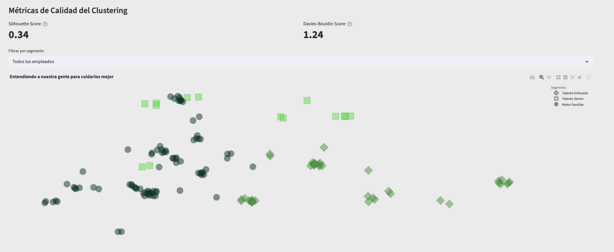
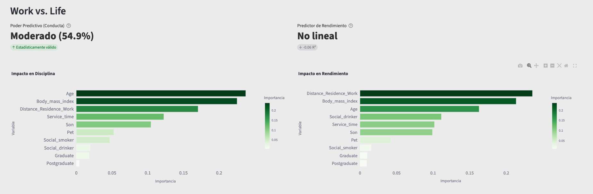
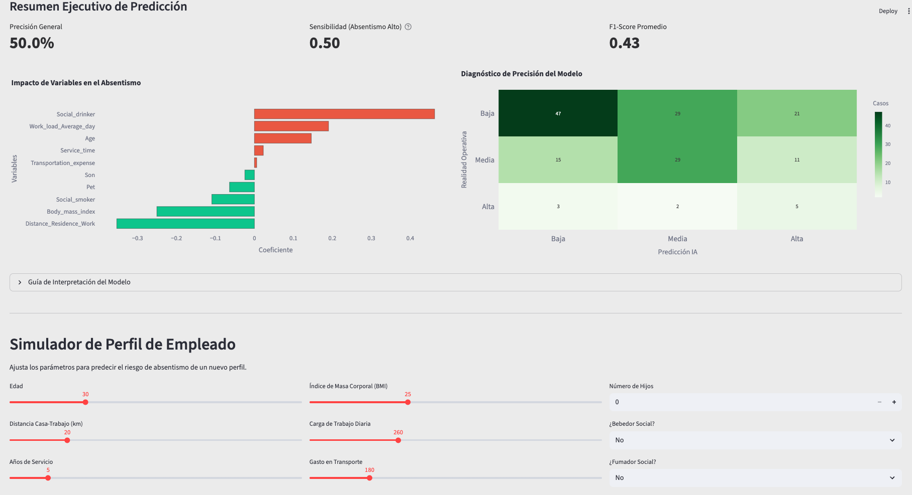

# Rapid Express - IA de Predicción de Absentismo


## 🎯 Visión del Proyecto
Este ecosistema de datos transforma registros históricos de RR.HH. en un **motor de decisión predictivo**. No solo visualizamos el pasado, sino que anticipamos el absentismo crítico mediante Machine Learning para optimizar la logística de Rapid Express.

## 🚀 Características Principales
* **Radiografía IA:** Identificación de variables críticas (Carga de trabajo, BMI, Edad).
* **Diagnóstico de Precisión:** Matriz de confusión integrada para validar la fiabilidad del modelo.
* **Simulador en Tiempo Real:** Interfaz para predecir el riesgo de nuevos perfiles de empleados.

## 📊 Análisis Predictivo y Diagnóstico

### 1. Panel de Control de KPIs (Metas Operativas)


> **Insight:** Visualizamos en tiempo real el poder predictivo del modelo (**54.9%**) y nuestra tasa de detección temprana.

### 2. Factores de Influencia y Matriz de Verdad


> **Insight:** Identificamos variables críticas como "Social Drinker" y validamos la precisión con la Matriz de Confusión.

### 3. Simulador Predictivo Proactivo


> **Insight:** Herramienta interactiva para evaluar perfiles y diseñar planes de bienestar personalizados.
---

## 💰 Impacto en el Negocio (ROI)
La implementación de este modelo en Rapid Express no es solo técnica, es financiera:
* **Reducción de Costes de Reemplazo:** Detectar un 28.6% de las bajas críticas con 24h de antelación permite evitar la contratación de servicios de emergencia externos (E.T.T.), que suelen ser un 40% más caros.
* **Optimización de Rutas:** Al predecir el absentismo "Bajo" con alta precisión, aseguramos que el 90% de las rutas troncales nunca se queden sin conductor asignado.

## 🛠️ Instalación y Uso

1. **Clona el repositorio:**
   ```bash
   git clone [https://github.com/jmessiasgarcia/talent_vision.git](https://github.com/jmessiasgarcia/talent_vision.git)
